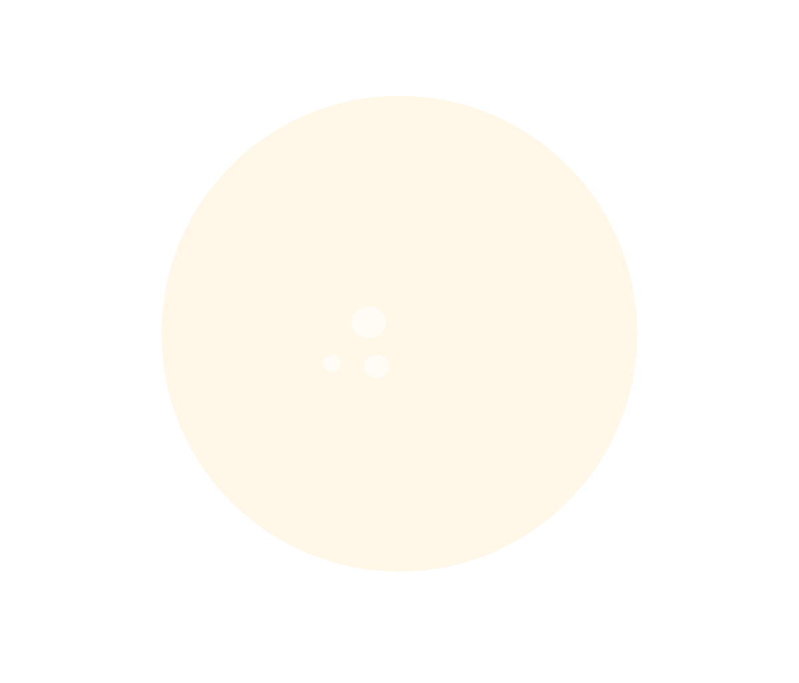

# **Portfolio - Desk**
## **Objectif**
Ce site a pour but d'être un portfolio digital simulant un bureau physique sur lequel nous trouverons des dossiers interactif pouvant être déplacé librement et les ouvrir pour accéder aux différents travaux.

## **Méthode**
Pour réaliser ce projet, j'utilise pour le moment un code très simple basé sur la librairie [Draggabilly](https://draggabilly.desandro.com) permettant de drag des éléments ciblés.

## **Asset Graphique**

### **• Dossiers**
*Déplaçables et cliquables pour voir les projets.*

### **• Lampe**
*Possible de la déplacer sur une zone limitée pour changer la lumière de positions*

>*Les différents éléments graphique présent dans ce projet sont des fichiers svg fait directement sur [Figma](https://www.figma.com/design/kIzGWnAUqMxBjMXi8DfAgu/Creative-coding?node-id=0-1&t=EicvjkqCWVxnQfLW-1) (pour l'instrant) exclusivement de figm*

## **Problème rencontré**

- L'effet "Grab" s'applique aussi aux zones transparentes des SVG
  *(solution possible : appliquer un "Handle" sur les parties visible)*